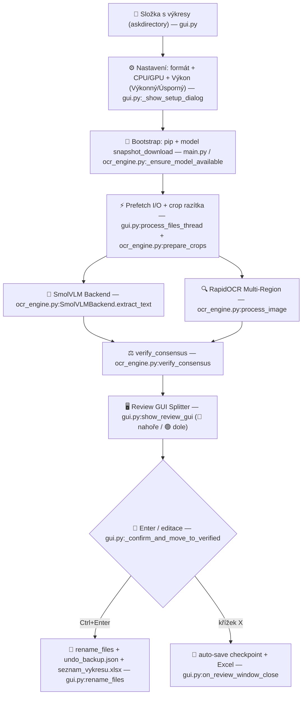

# Technická dokumentace — Přejmenování výkresů v2.2.0

> **Program:** Inteligentní rozpoznávání, evidence a dávkové přejmenování technických výkresů  
> **Technologie:** SmolVLM-500M-Instruct (VLM) + RapidOCR (onnxruntime) / EasyOCR fallback · Tkinter GUI · OpenPyXL · Python 3.10+  
> **Optimalizace:** Dynamická INT8 CPU kvantizace, CUDA FP16 + torch.compile, CLAHE, asynchronní prefetch I/O  
> **Nasazení:** Production ready — auto-bootstrap závislostí + modelu při prvním spuštění, hardwarová adaptace  
> **Poslední aktualizace:** 2026-08-26 — ověřeno vůči `main.py`, `gui.py`, `ocr_engine.py`, `parser.py`, `config.py`, `config.json`, `run.bat`, `requirements.txt`, `VERSION`

---

## 1. Architektura systému

Hybridní **VLM + OCR + konsenzus** pipeline (`ocr_engine.py:1`). Skeny (`.tif/.tiff/.jpg/.jpeg/.png`) analyzuje lokální `SmolVLM-500M` a `RapidOCR`, shodu vyhodnocuje binární konsenzus `verify_consensus`.

Vstup `main.py:1` ověří Python ≥3.10, automaticky doinstaluje chybějící pip balíky s progress oknem (`_check_dependencies_bootstrap`), inicializuje logování (`config.py:setup_logging`) a spustí `RenameApp`.

---

## 2. Hardwarová adaptace a výpočetní profily

### 2.1 Detekce HW — `config.py:get_hardware_specs()`

- CPU jádra: `os.cpu_count()`
- RAM: Windows API `GlobalMemoryStatusEx` (`ctypes`), fallback `16 GB`
- GPU: `torch.cuda.is_available()` + `get_device_properties(0)` (jméno + VRAM v GB)
- XPU: `torch.xpu.is_available()` (Intel)

`config.py:get_detected_devices()` vrací `list[(key, label, available)]` pro radio buttony v `gui.py`.

### 2.2 Dynamické profily — `config.py:get_dynamic_hardware_profiles(model_id)`

Voláno s `default_model` z `config.json` pro model-specific rozlišení:

| Profil | `cpu_threads` | `win_priority` | `max_image_dim` | `inter_file_pause_s` | `io_workers` |
|---|---|---|---|---|---|
| **🚀 Výkonný** (`turbo`) | `min(cpu_count, 16)` (při `cpu<=4` ponechá 1 jádro: `cpu-1`) | `0x80 HIGH` (při `cpu<=4` `0x8000 ABOVE_NORMAL`) | `1024` pro VisionPsy / `1280` jinak (poníženo na `768/1024` při nízké RAM) | `0.0` | `min(4, max(2, cpu//4))`, při `ram<8GB` → `2` |
| **🌱 Úsporný** (`eco`) | `1` (při `cpu<=4`) jinak `max(1, min(2, cpu//4))` | `0x4000 BELOW_NORMAL` | `768` / `1024` | `0.05` | `1` |

Názvy profilů byly zjednodušeny na **Výkonný** a **Úsporný** (krátké názvy `short_name` jsou `Výkonný` / `Úsporný` bez uvádění počtu CPU vláken v názvu).

### 2.3 Aplikace profilu — `config.py:apply_hardware_profile(profile_key)`

- Env: `OMP_NUM_THREADS`, `MKL_NUM_THREADS`, `OPENBLAS_NUM_THREADS`, `NUMEXPR_NUM_THREADS`, `VECLIB_MAXIMUM_THREADS`, `KMP_BLOCKTIME=0`, `MKL_DYNAMIC=FALSE`, `OMP_DYNAMIC=FALSE`, `OMP_WAIT_POLICY=PASSIVE`, `KMP_AFFINITY=granularity=fine,compact,1,0`
- Windows priorita: `SetPriorityClass(GetCurrentProcess(), priority)`
- Voláno z `ocr_engine.py:load_models` před volbou zařízení

### 2.4 CPU vs GPU režim — `ocr_engine.py:load_models()`

- Volba `device_choice`: `cuda`/`cpu`/`xpu`/`auto` (uloženo `config.json:device`)
- `cuda`: `empty_cache()`, `cudnn.benchmark=True`, `torch.compile(mode="reduce-overhead")` (skip na `win32`/VisionPsy/Qwen/GLM pro stabilitu), VLM+OCR paralelně v `ThreadPoolExecutor(max_workers=2)`
- `cpu`: `set_num_threads(threads)` + `set_num_interop_threads(1)`, `torch.set_flush_denormal(True)`, INT8 `quantize_dynamic({Linear}, qint8)`, sekvenční běh (zabraňuje thrashing)
- **OOM fallback** `SmolVLMBackend.extract_text`: při `CUDA OOM` → `empty_cache()`, přesun na `cpu`, re-kvantizace a opakování `generate` na CPU

---

## 3. First-run bootstrap (produkční nasazení)

### 3.1 Závislosti — `main.py:_check_dependencies_bootstrap()`

- Mapy `REQUIRED_MAP` (torch, torchvision, transformers, PIL, numpy, openpyxl, rapidocr_onnxruntime, huggingface_hub, cv2, einops, accelerate) a `OPTIONAL_MAP` (easyocr)
- `_find_missing()` zjistí chybějící importy; pokud prázdné → pokračuje
- Jinak `_show_bootstrap_window()` s `Toplevel`: header, seznam chybějících, `Progressbar indeterminate`, `Text` pro pip log, `threading.Thread` spouští `python -m pip install -r requirements.txt --disable-pip-version-check` s streamingem do `queue.Queue` a `root.after(80, poll)`. Po `returncode==0` re-check importů; při selhání dialog s manuálním návodem a `FINAAL_NO_AUTO_INSTALL=1` bypass.
- Kontrola Python verze `MIN_PYTHON=(3,10)` s GUI hláškou

### 3.2 AI model — `ocr_engine.py:_ensure_model_available()`

- `APP_DIR = dirname(abspath(__file__))`, `HF_HOME = APP_DIR/models` (nastaveno v `config.py` při importu)
- `_find_local_model_path(model_id)` hledá `models/<repo>` a `models/hub/models--.../snapshots/<hash>/`
- Pokud nenalezen a `FINAAL_NO_AUTO_DOWNLOAD!=1`:
  1. `progress_callback("Stahuji AI model (první spuštění, ~7 GB)…", 3)` + `logger.info`
  2. `from huggingface_hub import snapshot_download; snapshot_download(repo_id, local_dir=..., local_dir_use_symlinks=False)` (why: Windows bez admin práv)
  3. Fallback do HF cache (`snapshot_download(repo_id)` bez `local_dir`)
  4. Při `free_gb<8.0` warning; při výjimce `messagebox.showerror` s offline návodem a `raise RuntimeError`
- Voláno z `load_models()` před `SmolVLMBackend(...)`; progress integrován do `gui.py:process_files_thread` queue (`model_progress`)

### 3.3 `requirements.txt` a `run.bat`

- `requirements.txt`: `torch`, `torchvision`, `transformers>=4.44`, `huggingface_hub`, `einops`, `accelerate`, `rapidocr_onnxruntime` (povinné) + `easyocr` (volitelný fallback, ~500 MB, v requirements zakomentován) + `opencv-python`, `numpy`, `Pillow`, `openpyxl` (vše `>=` s komentářem `file:line`)
- `run.bat`: `chcp 65001`, `PYTHONUTF8=1`, detekce `python`/`py`, kontrola verze, `python main.py`, rozlišení chyb s odkazem na `rename_drawings.log`

---

## 4. Zpracování obrazu a Multi-Region OCR

### 4.1 Načtení — `ocr_engine.py:load_and_resize_image(fpath, max_dim)`

`PIL.Image.open → convert RGB → LANCZOS` pokud `max(w,h) > max_dim`. `max_dim` z profilu (`gui.py:process_files_thread`). Ochrana `Image.MAX_IMAGE_PIXELS = 500_000_000` (500 Mpx, navýšeno z původního limitu 100_000_000 / 100 Mpx pro bezproblémové načtení A0+ skenů).

### 4.2 Ořezy razítka

- **Zóna 1 — Dolní razítko** `crop_title_block`: `(0.45*w, 0.55*h, w, h)` → 55 % ×45 %, vždy
- **Zóna 2 — Horní záhlaví** `crop_top_header_block`: `(0,0,w,0.35*h)` → podmíněně pokud `!vlm_num` nebo `best_ocr_score<70` nebo neshoda VLM vs OCR (`ocr_engine.py:process_image`)
- **Zóna 3 — Globální** (`process_image`): celý `img_resized` s `canvas_size=1280` — jen když Zóna 1+2 nenašla číslo

`prepare_crops(img, device)` vrací `(crop_br, crop_br_enh, crop_ocr)` s `BILINEAR` resize; `_CPU_OCR_MAX_DIM=960`, `_GPU_OCR_MAX_DIM=1280`; `_resize_for_vlm_cpu` zmenší na `512` (VisionPsy) / `768` (ostatní) na CPU.

### 4.3 Enhancement — `ocr_engine.py:enhance_for_ocr(img, use_clahe=None)`

Auto-detekce vybledlého skenu (`mean>180` nebo `std<35`): `cv2.createCLAHE(clipLimit=2.5, 8×8) + medianBlur`, jinak `autocontrast(cutoff=1) → Contrast 1.4× → Sharpness 1.4×`. `use_clahe` lze vynutit.

### 4.4 Prefetch — `gui.py:process_files_thread`

`ThreadPoolExecutor(max_workers=io_workers)`, `_prefetch(fpath, dim) = load_and_resize_image + prepare_crops` pro následující soubor během inference. `pause_s` dle profilu. Progress via `queue` (`model_progress`, `file_progress`, `done`, `paused`).

---

## 5. Parsování — `parser.py`

### 5.1 Normalizace — `clean_text_for_numbers(text)`

- Spojí `10.53.03→105303`, `442 01075 029 4 → 442010750294` iterativním glue (`_RE_GLUE_SPACE` 3×, `_RE_GLUE_DOT`), suffixy `105303 a→105303a`, lomítka `100805/b→100805b`. Regex `_RE_DOTTED_PAIRS/_TRIPLETS/_2_4/_4_2/_GLUE_*/_SPACE_SUFFIX/_SLASH_SUFFIX`.

### 5.2 Rozdělení — `split_drawing_details(num_str) -> (base, suffix, part)`

`10–14` cifer nedělí; jinak detekce `_part` (`_11`) a `suffix` (`K20`, `sp1`, `R_L`, `a-b`). `E103322` nedělí.

### 5.3 Skórování — `extract_drawing_number(text)`

- Regex `_RE_UNIVERSAL_DRAWING`: `\b([A-Za-z]{0,2}\d{4,14})(?:[-_/]?([a-z]{1,3}\d{0,2}(?:-[a-z])?|[Kk]\d{1,2}|sp\d?|R_L))?` + fallback `_RE_ALPHANUM_DRAWING`
- Kontext `60` znaků před/za, skóre: `digits*10`, `+15` pro `0xxxx` 5-místné, `+25` pro `5–14` ne-ocel, `+20` pro `K/sp/R_L` suffix, `+35` u labelu `výkres/zeichnung`, `-60/-50` pro roky `1900–1999`, `-70` pro složená data `291923`, `-100` u `Změny/Änderung`, `-80` u `ČSN/DIN/materiál`, `-50` pro oceli `_KNOWN_STEEL_GRADES` mimo razítko

### 5.4 Disambiguace — `disambiguate_drawing_number(cand)`

`o/O→0`, `J/I/l 00→1`, `_5/_s→sp1`, `sp→sp1`, `a_b→a-b`/`ab→a-b`.

### 5.5 Geometrie boxů — `extract_best_from_ocr_boxes(ocr_results)`

`h,w,cx,cy` z bbox, `median_h`, shluky řádků `|cy diff|<0.8*median_h`, zkouší spojit `4420…` na 12místné po `clean_text_for_numbers`, skóre `h_ratio*25 + conf*20 +35`.

---

## 6. Ověřovací konsenzus — `ocr_engine.py:verify_consensus(vlm_num, ocr_results, all_ocr_text)`

Vstupy po `disambiguate`, `ocr_best_num` z boxů nebo `extract_drawing_number(all_ocr_text)`.

| Výsledek | Podmínka | GUI |
|---|---|---|
| `K ověření (Nenalezeno)` | `!vlm_num && !ocr_num` | 🔴 |
| `K ověření (Pravděpodobně číslo materiálu)` | `digits in _KNOWN_STEEL_GRADES` | 🔴 |
| `K ověření (5místné číslo)` | `len<=4` vždy K ověření; `len==5 && !leading0` podezřelé, ale může být Ověřeno při shodě VLM+OCR (`ocr_engine.py:613`) | 🔴 |
| `K ověření (Neúplné 12místné)` | `442… len<12` + OCR obsahuje `442 0` | 🔴 |
| `K ověření (Pouze jeden model)` | `!vlm_num || !ocr_num` (automatické ověření jedním modelem bylo odstraněno — jeden model nyní vždy vrací K ověření) | 🔴 |
| `Ověřeno (Shoda AI + OCR)` | `clean_full shoda` nebo `similarity>0.95`, `len>=6` a shodný počet číslic (`len(digits_v) == len(digits_o)`) | 🟢 |
| `Ověřeno (Shoda AI + OCR)` | `clean_base shoda`, suffix/part konzistentní (doplní chybějící) | 🟢 |
| `K ověření (Neshoda suffixu)` | `base shoda` ale suffix/part rozpor | 🔴 |
| `K ověření (Neshoda AI a OCR)` | `base neshoda` | 🔴 |

`Ověřeno (Uživatelem)` vzniká v `gui.py:_confirm_and_move_to_verified` po `Enter`; fuzzy shoda `similarity>0.95` pro off-by-one (`100140 vs 100440`) vyžaduje shodný počet číslic (`len(digits_v) == len(digits_o)`); automatické ověření jedním modelem bylo odstraněno — pokud číslo nalezl pouze jeden model, vrací se vždy stav `K ověření`.

---

## 7. Export do Excelu — `gui.py:export_to_excel(path, items)`

- `openpyxl.Workbook`, list `Výkresy`, hlavička `["Číslo výkresu","Název výkresu","Formát"]` (`Segoe UI 11 bold #FFF` na `#1976D2`, `center`, `thin #D0D0D0`)
- Data `center/left/center`, `Segoe UI 10`, šířka `max(len)+6 min 18`, výška `25/20`
- Podporuje `export_to_excel(path, items)` i `(items, path)` (overload dle `isinstance(arg1,str)`)
- Zámek: fallback `_nove.xlsx` → `_{timestamp}.xlsx`
- Auto-export při `on_review_window_close` i `rename_files` do `seznam_vykresu.xlsx` ve zdrojové složce

---

## 8. GUI a stav — `gui.py`

### 8.1 Tok

1. `askdirectory` → `*.tif/*.tiff/*.jpg/*.jpeg/*.png` → `_prompt_resume_dialog` pokud checkpoint → `_show_setup_dialog` (Entry formát, radio device dle `get_detected_devices`, radio profily dle `get_dynamic_hardware_profiles`) → `save_config`
2. Loading okno: `lbl_status`, `Progressbar`, `lbl_pct`, `lbl_counter` (`prof_label | DEVICE`), ETA `avg_per_file`, tlačítko `⏸ Pozastavit a bezpečně ukončit` (`threading.Event`)
3. `process_files_thread` → `load_models(progress_callback)` → `file_progress` → `check_queue` (100 ms)
4. `show_review_gui`: `1600×920` / `zoomed`, `PanedWindow HORIZONTAL` `sashpos 720`, `Canvas + Scrollbar V/H`

### 8.2 Levý panel — tabulka

- `Canvas + scroll_frame`, `grid`, `MouseWheel` vertikálně, `Shift+MouseWheel` horizontálně (`Enter`/`Leave`)
- 5 sloupců, `row_items`/`entries`: `Label fname` (hand2), `Entry num` s `clean_only_drawing_number`, `Entry name`, `lbl_status` (`🟢`/`🔴`), `Checkbutton` dle `is_verified`
- Řazení: 🔴 nahoru, 🟢 dolů; statistika `lbl_summary`
- Interakce: `_relayout_rows`, `_confirm_and_move_to_verified` (Enter → zelená + `sort` + focus next + `update_live_preview`), `_ensure_row_visible` (`yview_moveto`), `Up/Down/FocusIn/KeyRelease`

### 8.3 Pravý panel — náhled

- `LabelFrame`, `lbl_preview_name`, `⟲ 100%` (`_reset_zoom`), `Otevřít (F3)` → `os.startfile`
- `_render_image_background`: `L → autocontrast → BILINEAR resize → Sharpness 1.35 → RGB` (vždy celý výkres)
- `update_live_preview(fname, conf, num)`: okamžitá textová aktualizace + `ThreadPoolExecutor` async render s `LRU OrderedDict size 30`, `request_id` zahazuje zastaralé, prefetch dalšího souboru; zoom `0.25–5×` (`_on_zoom` 1.18×), pan tažením (`_on_pan_start/_move`), `_render_zoomed` na `_pil_orig`

### 8.4 Přejmenování — `gui.py:rename_files()`

Sběr `to_rename` dle `var.get()` + `clean_only_drawing_number`, `askyesno` s počtem, `sanitize_filename` (`[<>:"/\\|?*]`, `rstrip('. ')`), `f"{safe_num} ({paper_format}){ext}"`, kolize a duplicity řešeny stylem Windows `f"{base} ({counter}){ext_part}"` (místo původního `{base}_{counter}`), `os.rename`, průběžný `json.dump` do `undo_backup.json`, souhrn s `verified_export_items` (jen `Ověřeno` nebo vše pokud žádné `Ověřeno`), `export_to_excel`, čištění checkpointu (smaže přejmenované klíče, `remove_folder_checkpoint` pokud prázdné), `messagebox` + `on_exit`.

### 8.5 Pomocné

- `sanitize_filename`, `clean_only_drawing_number` (odstraní `.tif/.jpg/.png` a ` (A4)`), `_update_stats_header`, `_set_all_checks`, `open_file`, `on_exit` (shutdown executor + destroy)

### 8.6 Zkratky

| Zkratka | Akce |
|---|---|
| `Enter` | Schválit → zelená + přesun dolů |
| `↑`/`↓` | Předchozí/další |
| `F3` / `Ctrl+O` | Otevřít |
| `Ctrl+A` / `Ctrl+D` | Zaškrtnout/odškrtnout vše |
| `Ctrl+Enter` | Přejmenovat |
| `kolečko` / `Shift+kolečko` | Svislý/vodorovný scroll |
| `kolečko` nad náhledem | Zoom, tažení = pan |

### 8.7 Checkpoint persistence — `session_checkpoint.json`

- Po každém souboru `save_folder_checkpoint(folder, {timestamp, updated_at, paper_format, hardware_profile, device, total_files, status:"processing"/"review", results:{fname:{num,conf,user_num,user_name,is_verified,is_checked}}})`
- `load_all_checkpoints` / `get_folder_checkpoint` / `remove_folder_checkpoint` (normalizace `abspath lower`)
- `_prompt_resume_dialog` s 3 volbami: `resume` (dopočítá chybějící), `review_now` (otevře GUI s hotovými), `restart` (smaže)
- Auto-save review: `_save_current_review_state()` při `WM_DELETE_WINDOW` (`on_review_window_close`) + `export_all_items_to_excel()`
- Tlačítko `💾 Uložit rozpracované` **odstraněno v 1.0.0** (nahrazeno automatickým ukládáním při zavření křížkem)
- `on_exit` → `preview_executor.shutdown(cancel_futures=True)` + `destroy` + `sys.exit`

---

## 9. Konfigurace, logování, soubory

### 9.1 `config.py` / `config.json`

- `APP_DIR`, `CONFIG_FILE` (`config.py:15`), `DEFAULTS`: `hf_home=./models`, `default_model=HuggingFaceTB/SmolVLM-500M-Instruct`, `paper_format=A4`, `hardware_profile=turbo`, `device=auto`, `max_image_dim=1280` (dynamicky přepočítáván)
- `load_config`/`save_config` (`indent=2`, `ensure_ascii=False`)
- `HF_HOME` absolutně při importu (`os.path.join(APP_DIR, hf_home)` → `os.environ["HF_HOME"]`)
- `config.json` je runtime (generován při prvním spuštění, nepatří do repo — `.gitignore`), default `device=auto` (dle HW přepne na `cuda`/`cpu`)

### 9.2 Logování — `config.py:setup_logging()`

`RotatingFileHandler` `rename_drawings.log` `10 MB ×2` (`SafeRotatingFileHandler` s `try:doRollover` pro Windows zámky), `DEBUG` do souboru + `INFO` do `stdout`, formát `%Y-%m-%d %H:%M:%S [LEVEL] name: msg`. `VERSION` čtena z `VERSION` souboru (2.2.0).

### 9.3 `main.py` / `run.bat` / `VERSION`

- `main.py`: `_check_python_version` + `_check_dependencies_bootstrap` + `setup_logging` + `Tk() → RenameApp → mainloop`
- `run.bat`: `chcp 65001`, `PYTHONUTF8=1`, detekce `python`/`py`, `python --version`, kontrola `>=3.10`, `python main.py`, `pause` při chybě s odkazem na log
- `VERSION:2.2.0`

### 9.4 `.gitignore`

Ignoruje `__pycache__/`, `*.pyc`, `.venv/`, `*.log`, `session_checkpoint.json`, `undo_backup.json`, `seznam_vykresu*.xlsx`, `models/hub/`, `*.bin/*.safetensors`, `Thumbs.db`, `.vscode/`, `.pytest_cache/`; zachovává `models/.gitkeep`

---

## 10. Struktura souborů

| Soubor | Účel | Řádky* |
|---|---|---|
| `main.py` | Vstup, bootstrap závislostí/modelu, logging, Tk | ~376 |
| `gui.py` | GUI, stavy, checkpoint/resume, progress+ETA, splitter, náhledy, přejmenování, Excel | ~1741 |
| `ocr_engine.py` | VLM backend, auto-download, RapidOCR, cropy, konsenzus, HW optimalizace | ~852 |
| `parser.py` | Regex, skórování, disambiguace, geometrie boxů | ~410 |
| `config.py` | Detekce HW, profily, device, logging, `HF_HOME`, `VERSION` | ~353 |
| `config.json` | Persistovaná volba uživatele (runtime, generováno za běhu, nepatří do repo — šablona 8 řádků) | — |
| `requirements.txt` | `torch`, `transformers`, `huggingface_hub`, `rapidocr_onnxruntime`, `opencv`, `einops`, `accelerate`, `openpyxl`, ... | 18 |
| `run.bat` | Windows spouštěč s kontrolami | ~70 |
| `VERSION` | `2.2.0` | 1 |
| `.gitignore` | Ignorace runtime/modelů | 40 |
| `models/` | `SmolVLM-500M-Instruct` (hub cache + `.gitkeep`) | — |
| `README.md` / `NAVOD.md` | Dokumentace | — |
| `session_checkpoint.json` | Runtime checkpoint (ne v gitu) | — |
| `undo_backup.json` | Záloha `{"folder":…, "renames":{new:orig}}` | — |
| `rename_drawings.log` | Rotující log | — |

\* orientační, mění se s verzí

`Vykresy/` je testovací složka (není součástí produkce). `benchmark.py` odstraněn (mrtvý kód).

---

## 11. Známá omezení a roadmap

- Windows-only (`os.startfile`, `GlobalMemoryStatusEx`, `SetPriorityClass`, `chcp 65001`)
- `torch.compile` skip na `win32` (bez `triton` pomalejší, ale stabilní)
- Offline režim vyžaduje ruční dodání `models/` a `pip install --no-index`
- Budoucí: Linux/macOS port, `bitsandbytes` 4-bit pro 6 GB VRAM, podpis `.exe` (PyInstaller), CI (GitHub Actions pin SHA)
